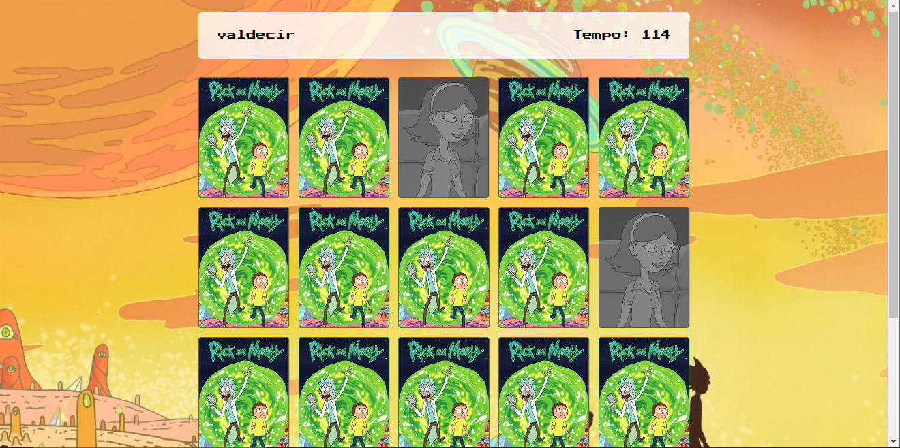

# Jogo-da-memoria-rick-and-morty
Um simples jogo da memória com o tema de rick and morty

## O projeto

  

## Resumo
Este projeto tem como objetivo a criação de um jogo, para exercicio das minhas habilidades como programador especificamente nas habilidades com Javascript e CSS3.
Futuramente serão adicionados:

| Recurso | Prioridade |
| ------ | ------ |
| Melhoria no Timer | 1 |
| Opção de nível de dificuldade | 1 |
| Contador de pontuações | 2 |
| Opção de reinicialização | 2 |

## Como rodar

### No Visual Studio Code ou via Browser
Realize o download do projeto e execute a pagina index.html

## Dependencias
Este projeto não possui dependências.

## Esta aplicação utiliza: 
JAVASCRIPT, HTML5, CSS3 e GIT
